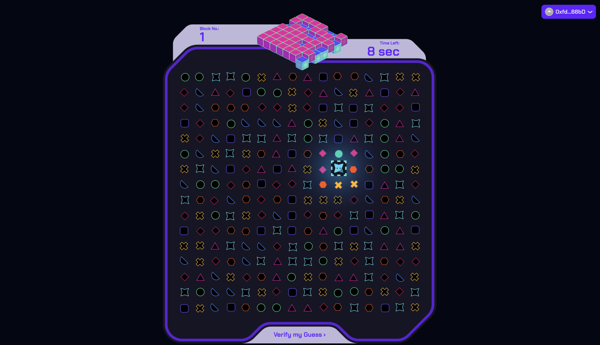
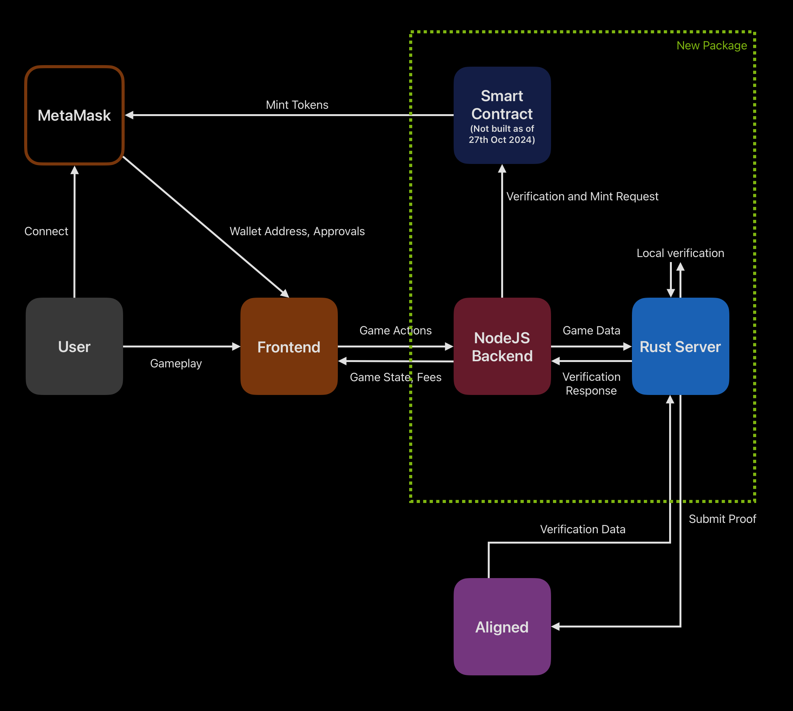

# Block-Nonce (Mini Game)

A full-stack Web3 game that gamifies blockchain block validation through an engaging bug-hunting challenge. Players explore a grid representing a block header (up to 16x16) searching for bugs (5-10) that represent the block's nonce. Success in finding all bugs is verified through zero-knowledge proofs using Aligned Layer, demonstrating both ZK technology and blockchain concepts in an interactive way.

### Game Mechanics

- **Grid**: Represents a block header (up to 16x16 cells)
- **Bugs**: Represent the block nonce (5-10 hidden bugs)
- **Time Limit**: Simulates block time
- **Verification**: ZK proofs verify successful bug discovery
- **Progress**: Each completed level represents a validated block

Players take on the role of validators, hunting for the correct nonce (represented by bugs) within each block's header space. The game combines educational blockchain concepts with engaging gameplay, all secured by zero-knowledge proof verification.



## Quick Start

1. Clone the repository

```bash
git clone <repository-url>
cd block-nonce
```

2. Install dependencies and build ELF file

```bash
# Install Rust verification server dependencies
cd ./zk-service/program
cargo prove build

cd ./zk-service/script
cargo run -r --bin server

# Install and start Node.js backend
cd ./backend
npm install
npm start

# Install and start frontend
cd ./frontend
npm install
npm run dev
```

3. Set up environment variables:

```bash
# In /rust-backend/.env
PRIVATE_KEY=your_private_key
RPC_URL=your_ethereum_node_url

# In /backend/.env (optional)
PORT=3001
RUST_SERVER_URL=http://127.0.0.1:8080
NETWORK=holesky
NODE_ENV=development

# In /frontend/.env.local (optional)
NEXT_PUBLIC_API_BASE_URL=http://localhost:3001
```

If you encounter any issues:

- Check if all three servers are running (Rust, Node.js, Next.js)
- Ensure your wallet is connected to Holesky testnet

4. Access the game at `http://localhost:3000`

## Architecture

Current Architecture



## Infrastructure Reusability

This project's architecture can be used as a template for creating similar ZK-verified games. The backend and ZK-verification services are designed to be game-agnostic and can be reused with different frontends.

### Creating Your Own Game

1. **Reuse Core Infrastructure**

   ```
   your-game/
   ├── backend/          # Reuse existing Node.js backend
   ├── zk-service/       # Reuse Rust verification server
   └── frontend/         # Your custom game frontend
   ```

2. **Customize Game Logic**
   - Modify the game state manager in backend
   - Adjust verification parameters in ZK service
   - Create your own frontend experience

### Example Game Types

- Hidden Pattern Games (Word Search, Treasure Hunt)
- Puzzle Verification Games
- Time-based Challenge Games
- Pattern Matching Games

### Future Modularization Plans

We plan to further modularize this infrastructure to make it even easier to build ZK-verified games:

- [ ] Create an npm package for the backend game service
- [ ] Develop a CLI tool for quick project setup
- [ ] Build a standard interface for game state management
- [ ] Provide developer templates for common game patterns
- [ ] Create documentation for custom game integration

### Integration Example

```typescript
// Future simplified setup
import { ZKGameEngine } from "@block-nonce/core";

const gameEngine = new ZKGameEngine({
  gameType: "grid",
  verificationRules: {
    type: "patternMatch",
    parameters: {
      /* your game parameters */
    },
  },
  stateManager: {
    /* your game state configuration */
  },
});
```

Stay tuned for these improvements! We welcome contributions to make this infrastructure more accessible to game developers.

## Project Structure

```
block-nonce/
├── frontend/          # Next.js frontend application
├── backend/           # Node.js game server
└── zk-service/        # Rust verification server
    └── program/       # ZK program
    └── script/        # Rust server
```

## Known Limitations & Future Improvements

### Current Limitations

- **Security**: Bug positions are currently shared with frontend for demonstration purposes
- **Scalability**: Game state is stored in memory without persistence
- **Verification**: Each game is verified separately instead of batch verification
- **Network**: Limited to Holesky testnet

### Planned Improvements

1. Move bug positions to backend only
2. Add database for game state persistence
3. Implement batch verification for multiple games
4. Add session management for multiple rounds
5. Enhance tokenomics and reward system

## Documentation

- [Frontend Documentation](./frontend/README.md)
- [Backend Documentation](./backend/README.md)
- [Rust Server Documentation](./zk-service/README.md)

## Development Stack

- **Frontend**: Next.js 13+, TypeScript, TailwindCSS, RainbowKit
- **Backend**: Node.js, Express, Socket.IO
- **Verification**: Rust, SP1, Aligned Layer
- **Network**: Ethereum (Holesky)

## Contributing

Please read the contributing section for details on our code of conduct and the process for submitting pull requests.

## Hackathon Notes

This project was developed for the Aligned Layer Builders Hackathon. It demonstrates:

- ZK proof integration in gaming
- Real-time gameplay with blockchain verification
- Modular architecture for extensibility
- Potential for enhanced game mechanics and tokenomics

## Acknowledgments

- Anshul C. - For invaluable UI/UX feedback that significantly improved the game's frontend experience
- Aligned Layer Team - For providing the ZK-proof verification infrastructure
- SP1 Team - For their ZK toolkit

## License

This project is licensed under the Apache License 2.0 - see the LICENSE file for details

Project Link: [https://github.com/Blockchain-Gods/block-nonce-minigame](https://github.com/Blockchain-Gods/block-nonce-minigame)
